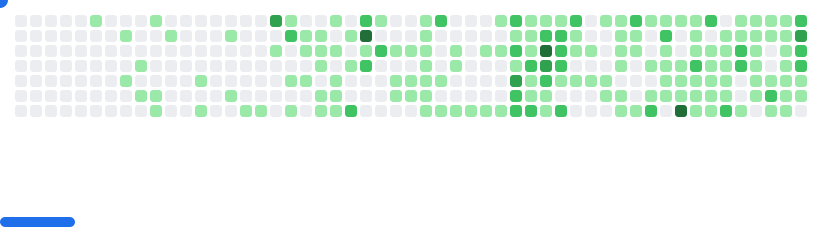

# Hi there, I'm Titan

###
<!-- 
 -->

<picture>
  <source
    media="(prefers-color-scheme: dark)"
    srcset="images/breakout-dark.svg"
  />
  <source
    media="(prefers-color-scheme: light)"
    srcset="images/breakout-light.svg"
  />
  
</picture>

###

## I'm a Problem Solver

- 💻 Coding and Data 👽
- 📚 I’m a Student in Data Science at Cakrawala University.
- 🥅 2025 Goals: Have new skills in Robotics, AI, Computer Vision, and Machine Learning
- ⚡ Fun fact: I love sports, cats, data, and problem solving

 

###

## Connect with me 

  
  <!--  -->
  
  <!--  -->
  
  <!--  -->
  

 

###

###

##  GitHub Stats

<!-- 

 -->

  
  <!-- 
   -->

###

##  Tech Stack

    
    
    
    
    
    
    
    
    
    
    
        
    
    
    
    
    
    
    
    
    
    
    
    
    
    
    
    
    
    
    
    
    
    
    
    
    
    
    
    
    
    

###

<picture>
  <source media="(prefers-color-scheme: dark)" srcset="https://raw.githubusercontent.com/titan2903/titan2903/output/pacman-contribution-graph-dark.svg">
  <source media="(prefers-color-scheme: light)" srcset="https://raw.githubusercontent.com/titan2903/titan2903/output/pacman-contribution-graph.svg">
  
</picture>

###

[instagram]: https://www.instagram.com/i_amdevelop/
[linkedin]: https://www.linkedin.com/in/titanio-yudista-153b79192/
[gmail]: mailto:titanioyudista98@gmail.com
[gitlab]: https://gitlab.com/titan03
